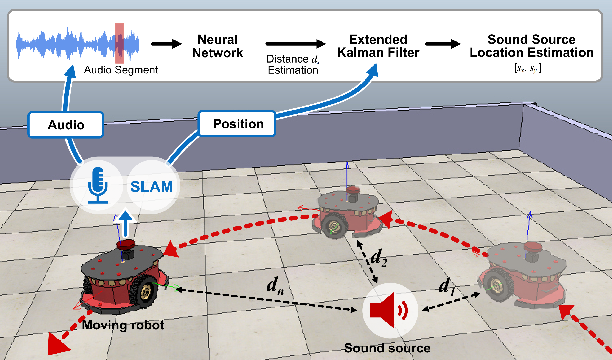
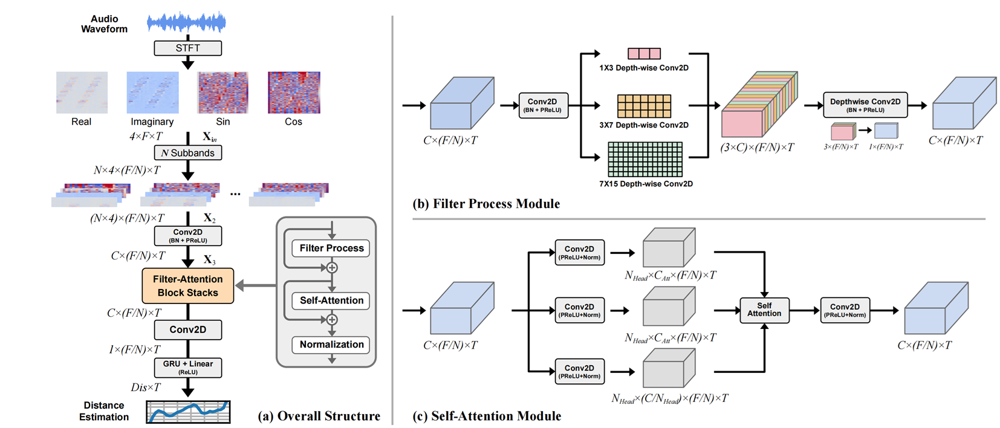
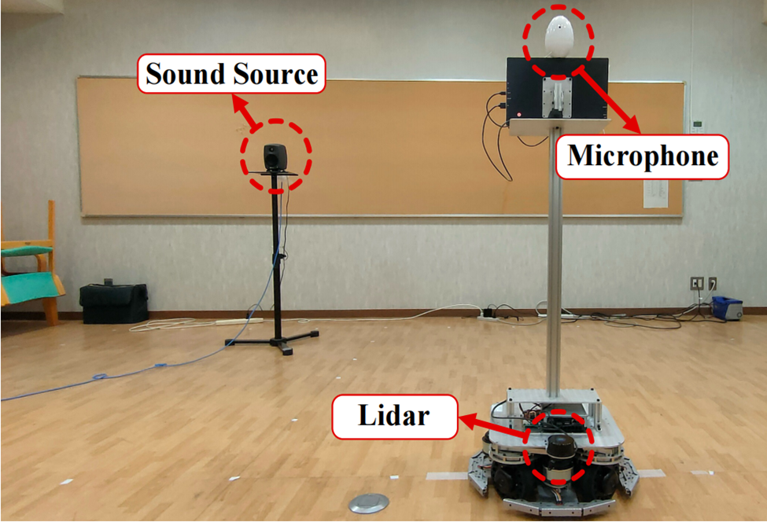

# Single-Microphone-Based Sound Source Localization for Mobile Robots in Reverberant Environments
- This is an online sound source localization method that uses **a single microphone** mounted on a mobile robot in reverberant environments. 

- Specifically, we develop a  lightweight neural network model with only 43k parameters to  perform real-time distance estimation by extracting temporal  information from reverberant signals. The estimated distances  are then processed using an extended Kalman filter to achieve  online sound source localization.

| Problem setup and sound source localization framework |
|---|
|<div align="center">| 

| Structure of the distance estimation neural network |
|---|
|<div align="center">| 

| Real World Setup |
|---|
|<div align="center">| 

## Detailed Usage
#### Distance Estimations
```bash
# 1. Prepare simulation datasets by FRAM_RIR script (https://github.com/tencent-ailab/FRA-RIR)
python produce_RIR_1_room.py      # 1 room
# or
python produce_RIR_100_room.py    # 100 rooms 

# 2. Change the paths in the files under the foders of "chirp_signals", "configs"

# 3. Train the model with simulation dataset
python train_dis_simu.py

# 4. Test the model with simulation dataset
python test_dis_sim.py
```

#### Sound source localization with real world datasets
```bash
# 1. Train the simulation model under 100 rooms

# 2. Fine tune the model with real world datasets
python train_dis_real.py

# 3. Test the model with real world dataset
python test_dis_real.py

# 4. Estimate the sound source positions using the jupyter file "sound_source_localization.ipynb"
```
## License
The source code and dataset are released under MIT license.

## Citation
Please cite the paper if you use the codes or data for your research.

```bibtex
@INPROCEEDINGS{2025SSL,
  author={Wang, Jiang and Shi, Runwu and Yen, Benjamin and Kong, He and Nakadai, Kazuhiro},
  booktitle={2025 IEEE/RSJ International Conference on Intelligent Robots and Systems (IROS)}, 
  title={Single-Microphone-Based Sound Source Localization for Mobile Robots in Reverberant Environments}, 
  year={2025},
  pages={6135-6140},
  doi={10.1109/IROS60139.2025.11246992}}
```