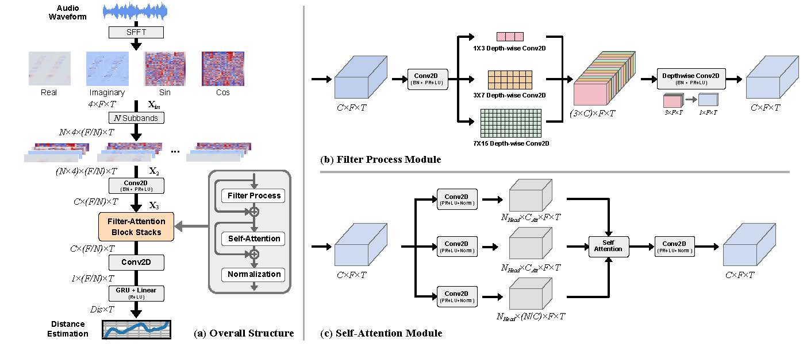

# Single-Microphone-Based Sound Source Localization for Mobile Robots in Reverberant Environments

---
Problem setup and sound source localization framework using a single microphone on a moving robot.

---
Overall structure of the neural network of the distance estimation via a single microphone.

#### The code is coming soon!!!
